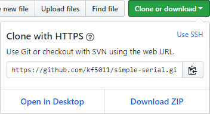
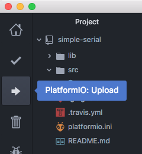

# Getting started
This is a quick guide to getting started using [Git](https://github.com), [Atom](https://atom.io), and [PlatformIO](https://platformio.org), in the context of this module.

# Workflow
The basic pattern for the lab classes, and ultimately the assignment, is:

 1. [Fork](#forking-a-repository) the repository on Github.
 2. [Clone](#cloning-the-repository) the repository on the local machine.
 3. [Work](#working-on-the-project) on the project
    1. Edit
    2. Compile
    3. Upload
    4. Evaluate
 4. Commit changes
 5. Push updates back to Github server.

# Github repository
The exercises for the practical sessions and the base skeleton for the assignment will be distributed via Github.  Github is a very good tool for managing and distributing source code.

## Lab material
Lab material will be distributed via public repositories, linked to from the module pages.  While you can download a .zip file containing the source, or clone the public repository, a better option is to fork the repository (which requires a Github account).

{: width='650' }

# Forking a repository
Look for the fork button  near the top right of the page.  _You will need to be signed into your gitub account_

Creating a fork, makes a copy of the repository under your id, you can then make changes to your copy, and log them back onto github servers.

 > Since the original repositories are public, your initial repository
 > will also be public.
 >
 > To make a private copy see the Github help page on
 > [Duplicating a repository](https://help.github.com/articles/duplicating-a-repository/)

# Cloning the repository
Making a clone of the repository, makes a local copy of the files that you can work on.  Although there are some good GUI based tools, personally I've found that the command shell tool the most convenient for this stage.

To clone the repository click on the green "Clone or download" button
  You will see a drop down box with a url and a copy icon.



You can pset the url into the command line for the `git clone` command

   ```shell_session
    $ git clone https://github.com/kf5011/simple-serial.git
   ```
   {: .alert .code}

If it clones sucessfully you'll see something like

   ```shell_session
   $ git clone https://github.com/kf5011/simple-serial.git
   Cloning into 'simple-serial'...
   remote: Counting objects: 17, done.
   remote: Total 17 (delta 0), reused 0 (delta 0), pack-reused 17
   Unpacking objects: 100% (17/17), done.
   $
   ```
   {: .alert .example}

You can now open the folder that has just been created in Atom through the "Add Project Folder" command.

> On my machine since I am already in the command shell I
> just type
>   ```shell_session
>   $ atom simple-serial
>   ```
>   {: .alert .code}
>
> or something like
>   ```shell_session
>   $ cd simple-serial
>   $ atom .
>   ```
>   {: .alert .code}
{: .alert .example}

# Working on the Project
[Atom](https://atom.io) and [PlatformIO](http://platformio.org/) provide a good environment for writing program code.





sudo adduser student dialout
